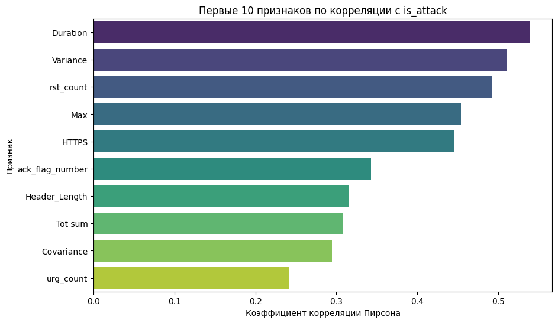
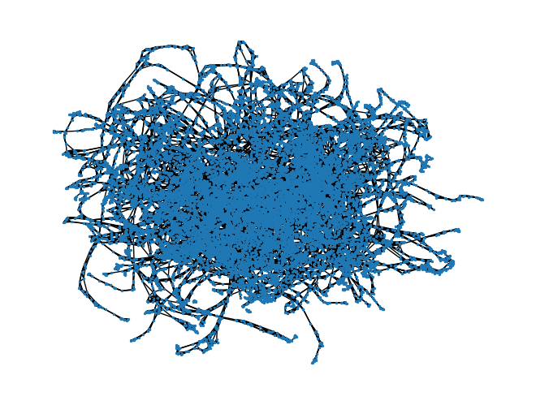
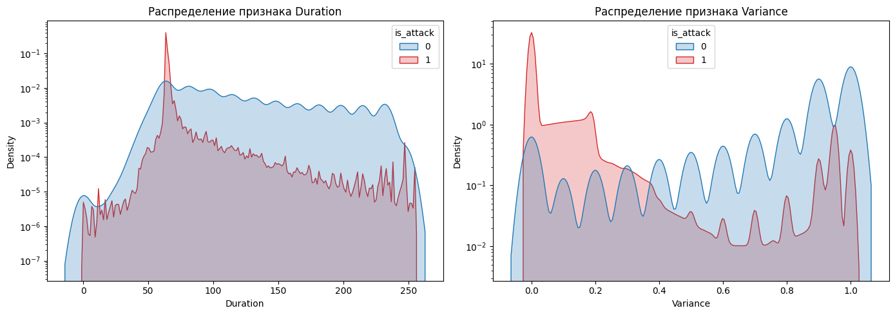

                                          Курсовая работа

                          на тему «Машинное обучение на графах в кибербезопасности»      
                    по дисциплине «Машинное обучение в сетевом и семантическом анализе»
Карта корреляции признаков с классом атаки

Изображение графа на библиотеке networkx(остутствуют адреса)

Распределение двух наиболее скоррелированных признаков

